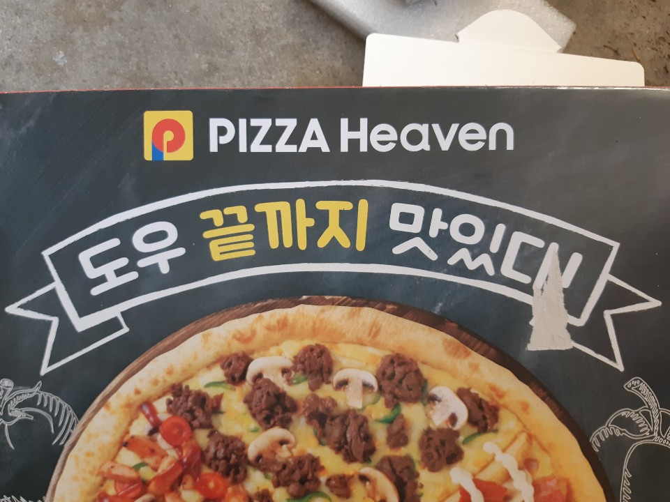
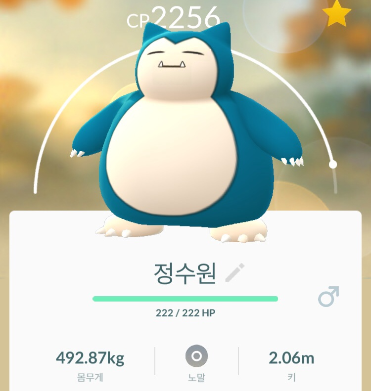
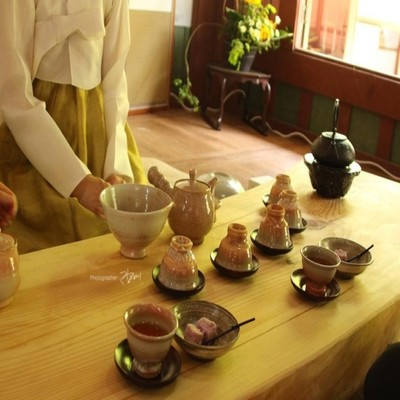

---
## 팀 소개 PT
#### 1반 뺌스(PPAEMS)조  
김도우 신동찬 이재서 이하동 정수원 정찬미
---
# 팀원 소개  
6명입니다.
---
### (P) 김도우  

연말 계획 : 없음  
별명 : 김돠  
성격 : 무난, 게으름  
---
### (P) 정찬미  
  

별명 : 찬메이  
성격 : 유한편  
연말 계획 : 없음  
---
### (A) 정수원
  

별명 : 또자  
성격 : 외향적  
연말 계획 : 연말 정산, 신년 계획
---
### (E) 이하동  
 

별명 : 노동  
성격 : 놀기 위해 일함  
연말 계획 : 대청소, 해리포터 정주행
---
### (M) 신동찬  
  

별명 : 티라노사우르스  
성격 : 꼼꼼한편  
연말계획 : 통계학 공부  
---
### (S) 이재서
  

별명 : 재서 치킨 리  
성격 : 차분하다  
연말 계획 : 울산 바다를 가족과 보면서 탁구 치기